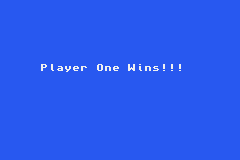

# gba-games

This repository includes gameboy advance games written using devkitpro.

To facilitate building the following docker image is used: [werner/devkitpro](https://hub.docker.com/r/werner/devkitpro/)

To build use the following:

    make

The generated gameboy advance roms can then be played using an emulator (VisualBoyAdvance):

    VisualBoyAdvance battleship/battleship.gba
    VisualBoyAdvance megatroid/megatroid.gba
    VisualBoyAdvance pong/pong.gba
    VisualBoyAdvance tetris/tetris.gba
